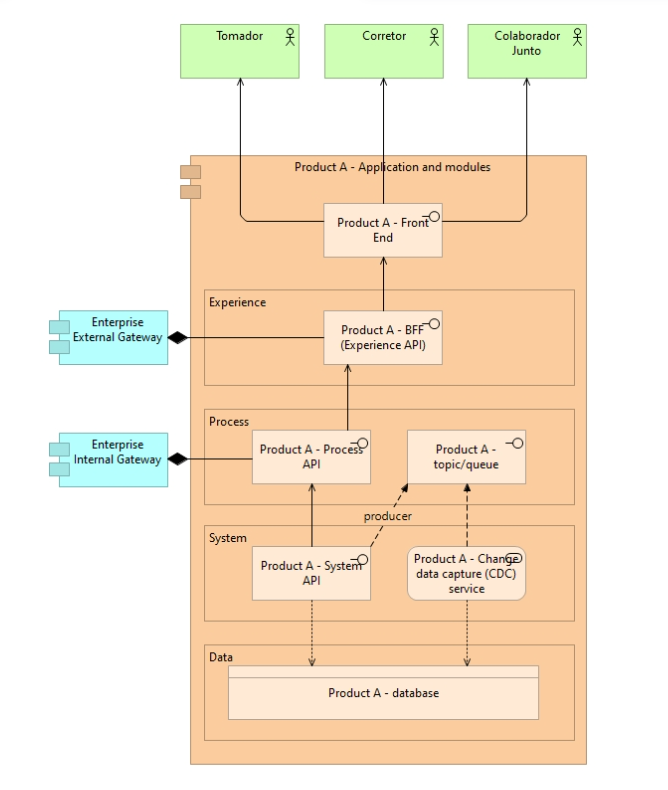

# Arquitetura de referência

A proposta da arquitetura de referência baseia-se na premissa de permitir conexão entre sistemas de forma eficiente e flexível.

No lugar de termos integrações ponto a ponto entre cada sistema a abordagem propõe APIs bem definidas que podem ser reutilizadas em várias integrações. A arquitetura de referência terá três camadas principais que possuem suas responsabilidades bem delimitadas, sendo: Experiencie APIs, Process APIs e System APIs.

 

-----

## Experiencie APIs

Esta camada se aproxima muito da Process API, porém seu foco se concentra na experiência do usuário final.

### Características

- Construção de APIs exclusivas para cada canal dos usuários (Front-end, Mobile, CLI, APIs públicas).
- Permite concentrar recursos adicionais de segurança como Autenticação e Autorização de acesso.
- Por ser uma API exclusiva para um canal, não gera acoplamento entre experiencias permitindo então o ganho de velocidade ao lanças novas features.

### Exemplos de uso

- Criação de BFF (Backend for FroentEnd) para atender a plataforma do Corretor e outra BFF para atender a plataforma do Tomador.
- API dos corretores (online-guarantee).

### Procure Não Fazer

- Ignorar a experiência do usuário final e focar nos requisitos técnicos ou de negócio.
- Levar regras de negócio/técnicas que deveriam estar contidas nas camadas de Process e System.
- Negligenciar a segurança das APIs.

#### Por que precisamos dessa camada?

- Foco: experiência acima da processo.
- Pode chamar de channels API, pois prover uma experiência otimizada em um canal específico é um pattern de valor.
- Camada responsável pela experiencia do cliente (podendo junto um ou mais processos disponíveis dentro da camada de Process).
- Separação de responsabilidade resulta em reuso e especialidade.
- Não acoplar os canais diretamente na camada de negócio.
- Implementar o conceito de headless que isola o Front-end das regras de negócio.
- Separar o perímetro das APIs (interno e externo).
- Concentração do routing e segurança em uma camada específica de perímetro externo.

-----

## Process APIs

Esta camada é responsável por orquestrar serviços e sistemas internos de uma organização para atender às necessidades de negócios dos clientes. Essa camada tem como objetivo principal abstrair a complexidade das integrações subjacentes, oferecendo uma interface de API simplificada e padronizada para os usuários finais.

### Características

- Permite a criação de APIs de alto nível.
- Facilita o desenvolvimento de integrações complexas.
- Possibilita a reutilização de componentes de integração em diferentes - contextos e cenários de uso, reduzindo o tempo e o esforço de desenvolvimento.
- Gerenciar a lógica de negócios, incluindo validação de entrada, - transformações de dados e enriquecimento de dados.

#### Exemplos de uso

- Cadastro de segurados: A camada poderia ser usada para gerenciar o processo de cadastro de segurados, orquestrando o fluxo de trabalho para a coleta de informações de novos segurados (busca na receita), validando e transformando os dados de entrada para garantir a integridade dos dados. Em seguida, a camada poderia integrar-se com os sistemas internos da seguradora para criar um novo registro de segurado (Sistema ERP, Resseguradora, etc).
 
- Cotação: simplificando o processo de cotação de seguros, a camada poderia abstrair a complexidade dos sistemas de preços, carteira do corretor, políticas internas (contrato resseguro, limites, bloqueios).
 
- Emissão: Semelhante a Cotação, poderia ir além e orquestrar processo de gerar parcelamentos, integrar com a resseguradora, com sistemas ERPs, sistema de Sinistros.

#### Procure Não Fazer

- Expor serviços internos de forma direta, sem a devida abstração.
Tentar criar APIs complexas demais, que dificultem o uso pelos usuários finais.
- Não monitorar o desempenho da API ou não identificar e resolver problemas de desempenho;
- Usar padrões ou tecnologias obsoletas que possam prejudicar a interoperabilidade com outros sistemas;
- Colocar regras de negócio no gateway de forma nenhuma.
- Não orquestrar composição de objetos complexos diretamente no gateway. nesse caso, crie um MS orquestrador.

#### Por que precisamos dessa camada?

- Foco: processo acima da conectividade.
- Se você está escrevendo uma aplicação que atualiza dados do corretor e da apólice, então você está escrevendo um monolíto.
- Se você está acessando aplicações existentes para criar um fluxo de negócio, então você está praticando arquitetura - composta (composable architecture).
- Separar a orquestração da "conectividade com aplicação" (system API) e com routing (experience API).
- Camada que concentra a lógica ponta-a-ponta de uma capacidade de negócio.

----

## System APIs

Esta camada é a fundamental entre as três pois expõe funcionalidades CORE de sistemas legados ou de novos serviços com base em seu domínio e contexto.

### Características

- Alta coesão.
- Baixo acoplamento.
- É dona dos seus dados provendo dados canônicos.
- Faz acesso a sua própria base.
- Não comunica diretamente com outra System API.

##### Exemplos de uso

- API Precificação de Apólices.
- API Contrato de Resseguro.
- API Segurado.
- API Tomador.

##### Procure Não Fazer

- Não expor essa API diretamente no external gateway.
- Não deve acessar o banco de dados de outra system api.
- Uma system API não deve escrever em um tópico(mensageria) de outra aplicação.

##### Por que precisamos dessa camada?

- Foco: conectividade com DB e acesso à dados.
- Nunca acessar diretamente ao banco de dados sem passar por uma interface "clean".
- Interface "clean" que conecte rapidamente capacidades de negócio.
- Ponto singular de CRUD garantindo que essa interface é a responsável por "comitar" no banco de dados.
- Abstrair a complexidade do modelo de dados e implementar regras corporativas em um ponto único.
- Manter uma camada de APIs estável e com ownership claro.
- Início da quebra do legado em pequenas partes acessíveis.
- Linguagem genérica com um propósito supera a linguagem de programação e a tecnologia através do tempo.
