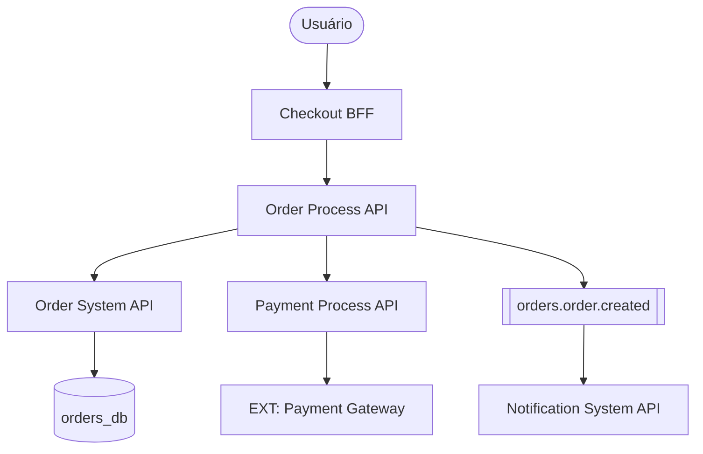
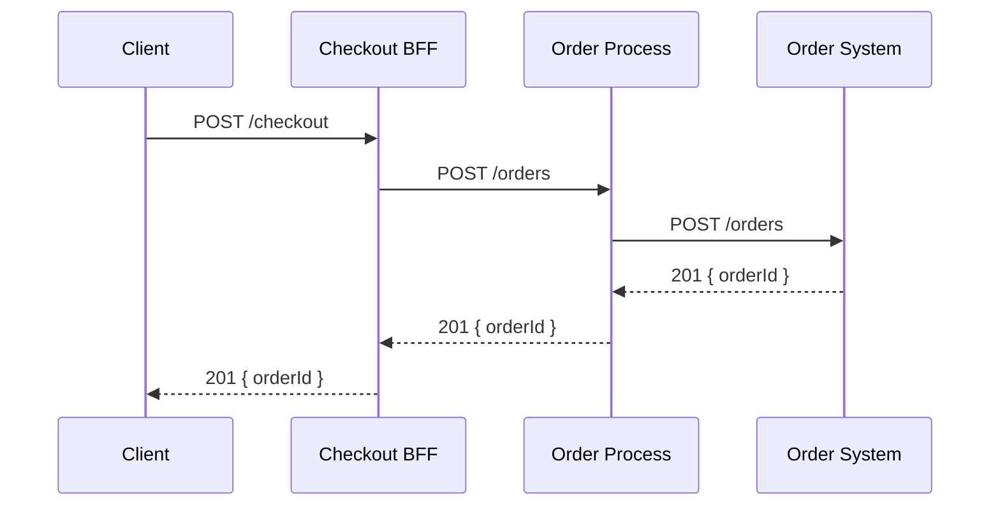
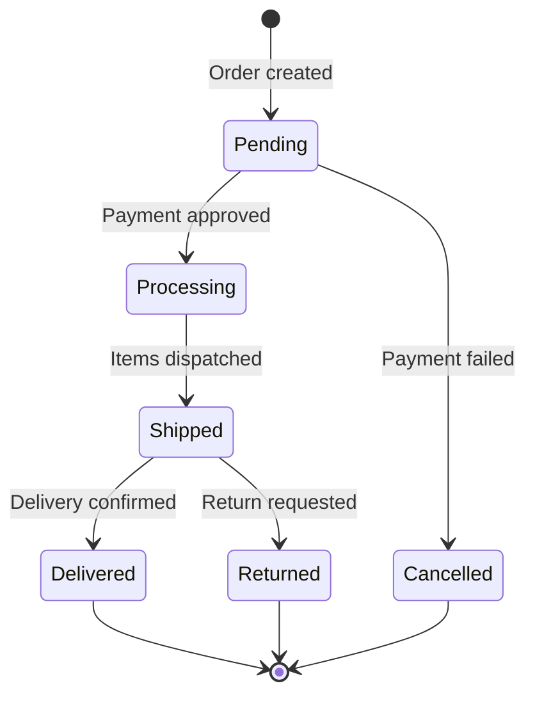

# Skill: gerar-diagrama

Produz **diagramas de arquitetura, fluxo e sequência** em formato texto (Mermaid) ou descrição estruturada para uso em documentação, PRs e discussões técnicas.

**Agente:** arquiteto  
**Guardrails aplicáveis:** `00-core.md`

---

## Quando usar

- Para documentar arquitetura de um novo serviço ou integração
- Para ilustrar fluxo de uma feature complexa (saga, fluxo assíncrono)
- Para comunicar decisão arquitetural em PR ou tech spec
- Para mapear dependências entre serviços existentes
- Quando texto não é suficiente para descrever a solução

---

## Tipos de diagrama disponíveis

| Tipo | Quando usar | Sintaxe |
|---|---|---|
| Arquitetura (C4 simplificado) | Visão geral de serviços e camadas | Mermaid `graph TD` |
| Sequência | Fluxo de chamadas entre serviços | Mermaid `sequenceDiagram` |
| Fluxo de estados | Ciclo de vida de uma entidade | Mermaid `stateDiagram-v2` |
| Entidade-Relacionamento | Modelo de dados | Mermaid `erDiagram` |
| Fluxo de processo | Decisões e ramificações | Mermaid `flowchart` |

---

## Entrada esperada

- O que deve ser representado (serviços, fluxo, entidade)
- Tipo de diagrama desejado (ou deixar o arquiteto escolher)
- Nível de detalhe: visão geral (C4 nível 2) ou detalhado (C4 nível 3)
- Contexto: PR, documentação, apresentação, debugging

---

## Processo de execução

### Passo 1 — Escolher o tipo correto

| Pergunta | Tipo recomendado |
|---|---|
| "Como os serviços se comunicam?" | Arquitetura ou Sequência |
| "Qual é o fluxo desta feature de ponta a ponta?" | Sequência |
| "Quais são os estados desta entidade?" | Fluxo de estados |
| "Como é o modelo de dados?" | ER |
| "Qual é o processo de decisão?" | Flowchart |

### Passo 2 — Aplicar convenções de nomenclatura

- Serviços em PascalCase: `UserService`, `OrderProcess`, `CheckoutBFF`
- Banco de dados com prefixo: `DB: users_db`
- Filas/tópicos entre colchetes: `[orders.order.created]`
- Atores externos em itálico ou com prefixo `EXT:`: `EXT: Payment Gateway`
- Usuário final: `User` ou `Client`

### Passo 3 — Nível de detalhe por audiência

| Audiência | Nível | O que incluir |
|---|---|---|
| Stakeholder de negócio | Alto (C4 L1) | Apenas atores e sistemas principais |
| Time de desenvolvimento | Médio (C4 L2) | Serviços, conexões, protocolos |
| Desenvolvedor implementando | Baixo (C4 L3) | Endpoints, payloads, order de chamadas |

---

## Saída produzida

### Diagrama de Arquitetura (exemplo)

### Diagrama de Sequência (exemplo)

### Diagrama de Estados (exemplo)

---

## Convenções de estilo

- Um diagrama por conceito — não combinar arquitetura com sequência no mesmo
- Título descritivo acima do diagrama
- Legenda quando símbolos não são óbvios
- Não incluir detalhes de implementação (nomes de variáveis, queries) — apenas responsabilidades e fluxos
