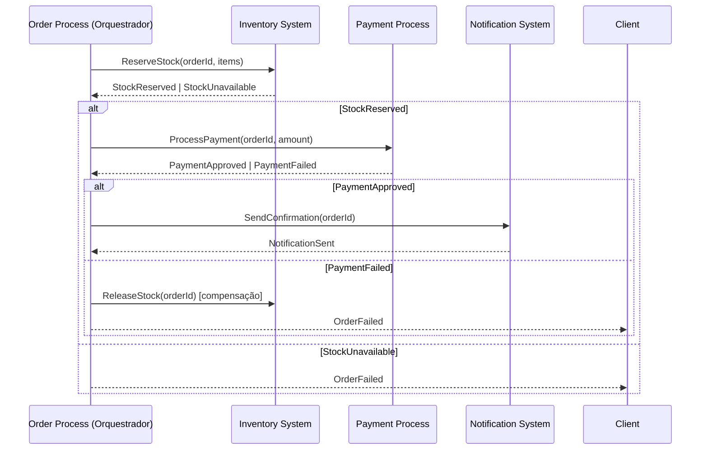

# Skill: implementar-saga

Desenha a **estratégia de orquestração ou coreografia** para um fluxo de negócio distribuído que envolve múltiplos serviços, garantindo consistência eventual e tratamento correto de falhas sem transação distribuída (2PC).

**Agente:** arquiteto  
**Guardrails aplicáveis:** `00-core.md`, `backend.md`, `dados.md`

---

## Quando usar

- Quando um fluxo de negócio requer escritas coordenadas em dois ou mais serviços independentes
- Quando uma transação ACID não é possível por cruzar fronteiras de serviço ou banco
- Para substituir chamadas síncronas encadeadas que criam acoplamento temporal
- Ao modelar compensação (rollback distribuído) de um fluxo que pode falhar no meio

---

## Conceitos

**Saga:** sequência de transações locais, onde cada passo publica um evento ou chama o próximo serviço. Se um passo falha, transações compensatórias desfazem os passos anteriores.

### Orquestração vs Coreografia

| Aspecto | Orquestração | Coreografia |
|---|---|---|
| Controle | Orquestrador central coordena | Cada serviço reage a eventos |
| Visibilidade | Fácil — lógica centralizada | Difícil — fluxo emergente |
| Acoplamento | Orquestrador conhece todos os serviços | Serviços conhecem apenas eventos |
| Falha | Orquestrador gerencia compensações | Cada serviço gerencia a própria compensação |
| Quando usar | Fluxos complexos com muitas ramificações | Fluxos simples com poucos serviços |

---

## Entrada esperada

- Nome do fluxo de negócio
- Serviços participantes e suas responsabilidades no fluxo
- Passo que pode falhar e o que deve ser compensado
- Requisitos de idempotência e retry
- Estratégia preferida: orquestração ou coreografia (ou deixar o arquiteto recomendar)

---

## Processo de execução

### Passo 1 — Identificar os passos do fluxo

Listar cada transação local em ordem:
1. Nome do passo
2. Serviço responsável
3. Operação executada
4. Evento publicado ao concluir
5. Transação compensatória (o que desfaz se necessário)

### Passo 2 — Classificar cada passo como compensável ou pivô

| Tipo | Descrição | Exemplo |
|---|---|---|
| Compensável | Pode ser desfeito com transação compensatória | Reservar estoque → Liberar estoque |
| Pivô | Ponto sem retorno — após ele, o fluxo vai para frente ou é abandonado | Aprovar pagamento |
| Retriable | Idempotente; pode ser repetido até concluir | Enviar e-mail, atualizar status |

### Passo 3 — Desenhar o diagrama da saga

Para orquestração — o orquestrador (Process API) controla:



### Passo 4 — Definir transações compensatórias

Para cada passo compensável, definir:
- Nome da operação de compensação
- Precondição para executar (quando disparar)
- Garantia de idempotência (ver `validar-idempotencia`)
- O que acontece se a compensação também falhar

### Passo 5 — Definir tratamento de falha

| Tipo de falha | Estratégia |
|---|---|
| Timeout em chamada síncrona | Retry com backoff exponencial + circuit breaker |
| Serviço indisponível | Dead letter queue + retry assíncrono |
| Falha de negócio (regra violada) | Compensação imediata sem retry |
| Compensação falha | Alarme + intervenção manual (DLQ + alerting) |

### Passo 6 — Definir rastreabilidade

- `correlationId` propagado em todos os passos do fluxo
- Estado da saga persistido no orquestrador (para recovery após crash)
- Log de cada transição de estado

---

## Saída produzida

```markdown
## Saga: <Nome do Fluxo>

**Estratégia:** Orquestração | Coreografia  
**Orquestrador:** <nome do serviço> (se orquestração)  
**Participantes:** <lista de serviços>

---

### Passos da saga

| # | Passo | Serviço | Transação local | Evento publicado | Compensação |
|---|---|---|---|---|---|
| 1 | Reservar estoque | Inventory System | UPDATE stock SET reserved | StockReserved | ReleaseStock |
| 2 | Processar pagamento | Payment Process | INSERT payment | PaymentApproved | RefundPayment |
| 3 | Confirmar pedido | Order System | UPDATE order SET status='confirmed' | OrderConfirmed | CancelOrder |

**Ponto pivô:** Passo 2 (PaymentApproved)

---

### Fluxo de compensação

Se o passo N falhar → executar compensações N-1, N-2, ... em ordem reversa.

| Compensação | Serviço | Precondição | Idempotente |
|---|---|---|---|
| ReleaseStock | Inventory System | StockReserved confirmado | Sim |
| RefundPayment | Payment Process | PaymentApproved confirmado | Sim |

---

### Tratamento de falha terminal

Se compensação falhar: publicar em `<fluxo>.saga.failed` + alertar oncall.

---

### Diagrama

<diagrama mermaid gerado no passo 3>
```
